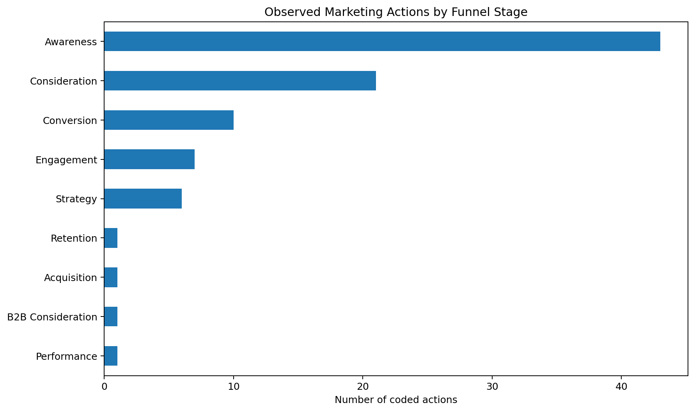
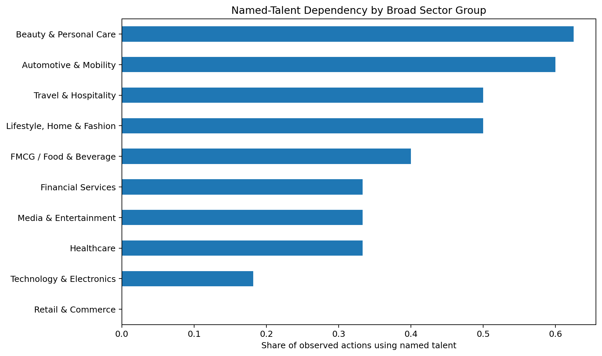
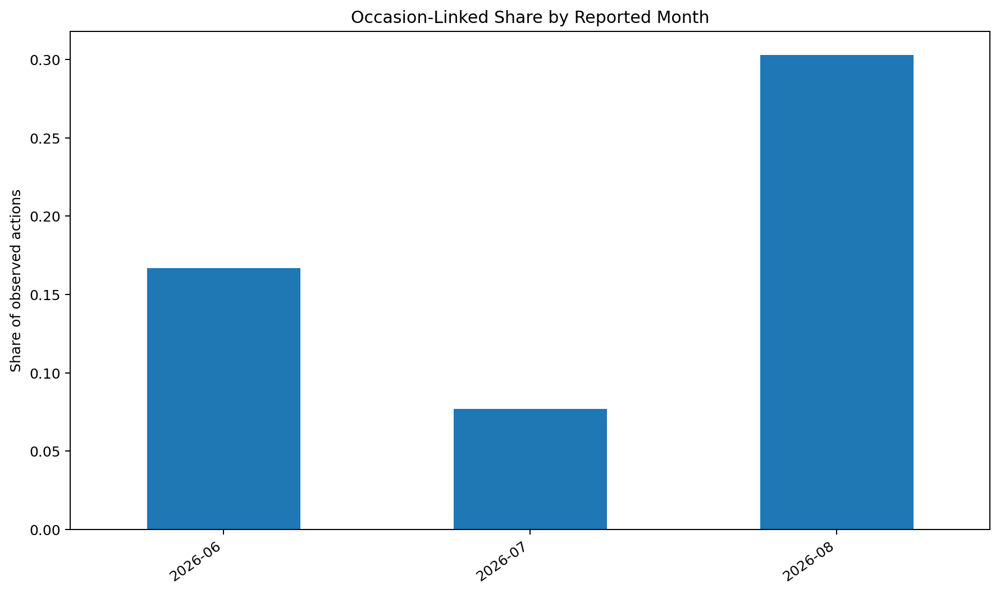
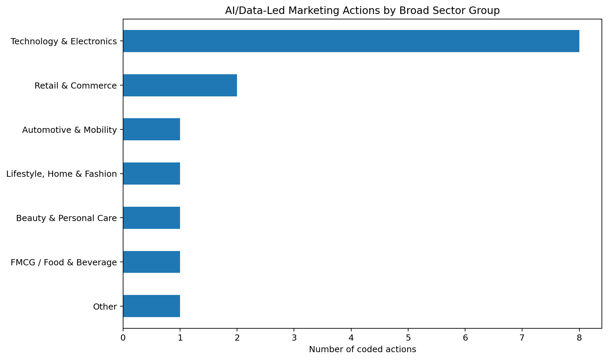

# India Campaign Genome 2026 🇮🇳

### A reproducible 90-day marketing-intelligence study of publicly reported Indian brand activity

**91 marketing actions · 88 brands/partnerships · 23 raw variables · June–August 2026**

This project reconstructs publicly reported marketing activity in India and converts fragmented campaign evidence into a structured dataset for **marketing analytics, brand strategy, consumer-culture research, and competitive intelligence**.

The goal is deliberately different from a standard downloaded sales dataset: the main contribution is the **creation, documentation, validation, and analysis of the marketing-intelligence dataset itself**.

> **Methodology note:** this is a retrospective public-source reconstruction, not a claim of continuous real-time monitoring. `reported_date` is the reporting/publication date and can differ from the exact launch date. No spend, ROI, impressions, reach, engagement, or sales-lift numbers have been fabricated.

---

## Research questions

1. Which broad sectors in the observed sample rely most on named celebrities or creators?
2. How important are festivals, awareness days, sports moments, and other occasions to campaign strategy?
3. Which actions are explicitly localized by city or region?
4. Where is AI/data materially part of marketing execution?
5. How is observed activity distributed across the marketing funnel?
6. How concentrated are sector-level channel choices?
7. Which sectors use the widest variety of coded creative strategies?

---

## Dataset snapshot

| Metric | Value |
|---|---:|
| Observed marketing actions | 91 |
| Unique brands / partnerships | 88 |
| Granular sector labels | 69 |
| Named-talent actions | 36 (39.6%) |
| Occasion-linked actions | 23 (25.3%) |
| AI/data-led actions | 15 (16.5%) |
| Explicitly regional/localized actions | 12 (13.2%) |
| Reported-date range | 1 Jun – 29 Aug 2026 |

These are **sample descriptors**, not population estimates for all Indian advertising.

---

## Key analytical outputs

### Funnel distribution



### Named-talent dependency



### Occasion-linked activity by month



### AI/data-led actions



---

## Analytical metrics implemented

### 1. Named-Talent Dependency Rate

`named-talent actions / all observed actions in a group`

Useful for comparing how strongly different sector groups lean on celebrities or creators in this sample.

### 2. Occasion Marketing Rate

`occasion-linked actions / all observed actions`

Captures campaign linkage to festivals, awareness days, sporting moments, cultural events, and other explicit occasions.

### 3. AI & Data-in-Marketing Rate

`AI-or-data-led actions / all observed actions`

Measures the share of observed actions in which AI or data is materially involved in marketing execution, targeting, media, content, or consumer experience—not merely mentioned as a theme.

### 4. Channel Concentration HHI

`HHI = Σ(channel share²)`

Higher HHI indicates a more concentrated observed channel mix.

### 5. Creative Strategy Diversity

Shannon entropy is calculated over the coded creative_strategy distribution, with a normalized 0–1 score used to compare creative-strategy diversity across sector groups.

---

## Repository structure

```text
India-Campaign-Genome-2026/
├── data/
│   ├── raw/                 # Original coded dataset
│   ├── processed/           # Reproducibly generated analytical dataset
│   └── metadata/            # Codebook and source registry
├── notebooks/
│   └── 01_india_campaign_genome_analysis.ipynb
├── src/
│   ├── features.py          # Derived analytical features
│   ├── metrics.py           # Original marketing metrics
│   ├── run_analysis.py      # Rebuild tables and figures
│   └── validate_data.py     # Data-quality checks
├── tests/
│   └── test_metrics.py
├── outputs/
│   ├── figures/
│   └── tables/
├── docs/
│   ├── methodology.md
│   ├── limitations.md
│   └── project_brief.md
├── .github/workflows/
│   └── validate.yml         # CI validation on every push/PR
├── requirements.txt
├── DATA_LICENSE.md
├── LICENSE
└── CITATION.cff
```

---


## Reproduce the project locally

### 1. Clone the repository

```bash
git clone https://github.com/dhruvtyagi0030/India-Campaign-Genome-2026.git
cd India-Campaign-Genome-2026
```

### 2. Create a virtual environment

**Windows**

```bash
python -m venv .venv
.venv\Scripts\activate
```

**macOS/Linux**

```bash
python -m venv .venv
source .venv/bin/activate
```

### 3. Install dependencies

```bash
pip install -r requirements.txt
```

### 4. Validate the data

```bash
python src/validate_data.py
```

### 5. Rebuild all processed data, tables, and figures

```bash
python src/run_analysis.py
```

### 6. Run tests

```bash
pytest -q
```

### 7. Open the notebook

```bash
jupyter notebook notebooks/01_india_campaign_genome_analysis.ipynb
```

---

## Methodology in one minute

- **Unit of analysis:** one publicly reported marketing action.
- **Coverage:** actions reported from 1 June to 29 August 2026.
- **Sources:** marketing-industry reporting and official brand/platform pages listed in `data/metadata/sources.csv`.
- **Manual coding:** sector, objective, channel, creative strategy, funnel stage, and related strategy fields.
- **Derived features:** generated in `src/features.py`; original raw fields are preserved.
- **Validation:** `src/validate_data.py` checks required columns, unique record IDs, dates, binary flags, and source URLs.
- **Automation:** GitHub Actions reruns validation, tests, and analysis on each push or pull request.

For the full protocol, see [docs/methodology.md](docs/methodology.md).

---

## Responsible interpretation

This repository should **not** be used to claim which campaigns performed best. Outcome metrics are not consistently public and were not invented.

Prefer language such as:

> “Within this 91-observation public-source sample...”

rather than:

> “Indian brands always...”

Full caveats are documented in [docs/limitations.md](docs/limitations.md).

---

## Portfolio value

This project demonstrates:

- marketing research design;
- original dataset construction;
- categorical coding and data normalization;
- marketing funnel analysis;
- celebrity/creator strategy analysis;
- festival and localization analysis;
- reproducible Python analytics;
- custom metrics (HHI, entropy, dependency rates);
- data-quality validation and automated testing;
- responsible interpretation of imperfect real-world marketing data.

A concise admissions/resume framing is available in [docs/project_brief.md](docs/project_brief.md).

---

## Data and code licenses

- **Code:** MIT License — see [LICENSE](LICENSE)
- **Structured dataset:** CC BY 4.0 — see [DATA_LICENSE.md](DATA_LICENSE.md)
- Linked articles, campaign assets, publisher text, and third-party creative remain the property of their respective owners.

---

## Citation

Citation metadata is provided in [CITATION.cff](CITATION.cff).
